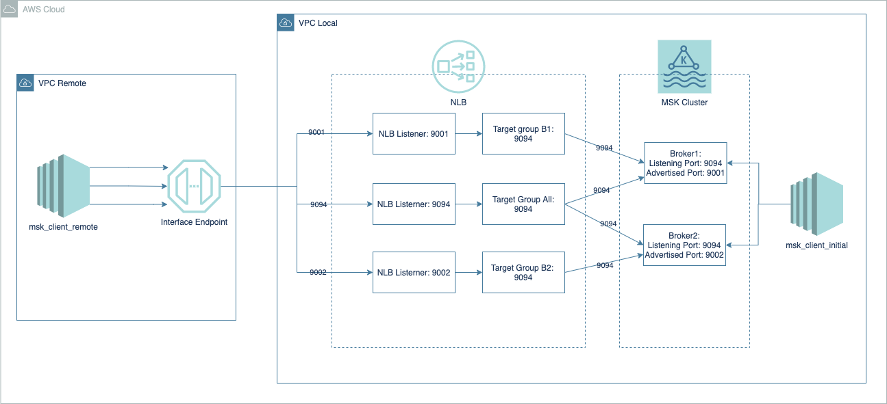

# MSK Cross Account Connectivity



This repo is used to implement the Amazon MSK clusters cross-account connectivity using Terraform. In this implementation we will follow the [pattern 2](https://aws.amazon.com/blogs/big-data/how-goldman-sachs-builds-cross-account-connectivity-to-their-amazon-msk-clusters-with-aws-privatelink/) in article **How Goldman Sachs builds cross-account connectivity to their Amazon MSK clusters with AWS PrivateLink** design to setup the infra and automate the MSK broker advertising setup using EC2 instance.

## High Level Design in Terraform

1. Create 2 VPCs both with public subnets
2. single subnet for client VPC  and 3 subnets for msk VPC
3. Create MSK cluster with plaintext and no auth
4. Configure each broker with listening port 9094
5. Configure each broker with unique advertised port 900X in Listener
6. Create NLBs for each advertized port mapping to the one listening port 9094
7. Create single endpoint in client VPC pointing to 3 different NLBs
8. create a new EC2 instance and launch an python script to setup the advertised port in each broker
9. terminated the ec2 once the python execution is complete.

## Implementation

### Prerequisite

1. clone the repo from [github](https://github.com/aws-samples/aws-msk-cross-account-connectivity-sample)
2. Download the kafka package `kafka_2.13-3.0.0.tgz` in Kafka [download page](https://kafka.apache.org/downloads) and upload to binaries s3 bucket.
3. update the example.tfvars variable to fit your environment

### Execute command

```sh
terraform init
terraform plan -var-file=example.tfvars -out .tfplan
terraform apply .tfplan
```

### Verify the connection form msk_client_remote node

1. Modify /etc/hosts file on EC2 instance in remote VPC

```sh
127.0.0.1   localhost localhost.localdomain localhost4 localhost4.localdomain4
::1         localhost6 localhost6.localdomain6

10.0.1.237 b-n.x.y.z.kafka.ap-southeast-1.amazonaws.com b-n.x.y.z.kafka.ap-southeast-1.amazonaws.com b-n.x.y.z.kafka.ap-southeast-1.amazonaws.com
```

2. Example execution to create topic from EC2 instance in remote VPC

```sh
./bin/kafka-topics.sh \
--command-config /root/client.properties \
--bootstrap-server b-1.example.cje4et.c2.kafka.ap-east-1.amazonaws.com:9094,b-2.example.cje4et.c2.kafka.ap-east-1.amazonaws.com:9094,b-3.example.cje4et.c2.kafka.ap-east-1.amazonaws.com:9094 \
--create \
--topic example \
--partitions 1 \
--replication-factor 1
```

3. Write topic

```sh
bin/kafka-console-producer.sh \
--topic example \
--producer.config=/root/client.properties \
--bootstrap-server b-1.example.cje4et.c2.kafka.ap-east-1.amazonaws.com:9094,b-2.example.cje4et.c2.kafka.ap-east-1.amazonaws.com:9094,b-3.example.cje4et.c2.kafka.ap-east-1.amazonaws.com:9094
```

4. Read topic

```sh
bin/kafka-console-consumer.sh \
--topic example \
--from-beginning \
--consumer.config=/root/client.properties \
--bootstrap-server b-1.example.cje4et.c2.kafka.ap-east-1.amazonaws.com:9094,b-2.example.cje4et.c2.kafka.ap-east-1.amazonaws.com:9094,b-3.example.cje4et.c2.kafka.ap-east-1.amazonaws.com:9094
```

## Reference

below command is implemented into source code already

Client properties (client.properties)

```sh
security.protocol=SSL
```

Configure brokers script (configure_brokers.sh)

```sh
#!/bin/bash

brokers_domain_name=$1
bootstrap_port=9094
replication_port=9093
replication_secure_port=9095
for i in 1 2 3; do
        broker_server=b-$i.$brokers_domain_name
        bootstrap_server=$broker_server:$bootstrap_port
        internal_server=b-$i-internal.$brokers_domain_name
        listener_port=900$i

        client_secure=$broker_server:$listener_port
        replication=$internal_server:$replication_port
        replication_secure=$internal_server:$replication_secure_port

./bin/kafka-configs \
--bootstrap-server $bootstrap_server \
--entity-type brokers \
--entity-name $i \
--alter \
--command-config /root/client.properties \
--add-config advertised.listeners=[\
CLIENT_SECURE://$client_secure,\
REPLICATION://$replication,\
REPLICATION_SECURE://$replication_secure\
]

done
```

Get Kafka node example

`aws kafka list-nodes --cluster-arn arn:aws:kafka:ap-east-1:<ACCOUNTID>:cluster/example/ef201dd6-d381-466d-84bc-ef86e4f7ec6a-2 --query 'NodeInfoList[*].BrokerNodeInfo.{id:BrokerId}'`

`aws kafka list-nodes --cluster-arn arn:aws:kafka:ap-east-1:<ACCOUNTID>:cluster/example/ef201dd6-d381-466d-84bc-ef86e4f7ec6a-2 --query 'NodeInfoList[*].BrokerNodeInfo.{id:BrokerId,point:Endpoints[0]}'`


## Security

See [CONTRIBUTING](CONTRIBUTING.md#security-issue-notifications) for more information.

## License

This library is licensed under the MIT-0 License. See the LICENSE file.